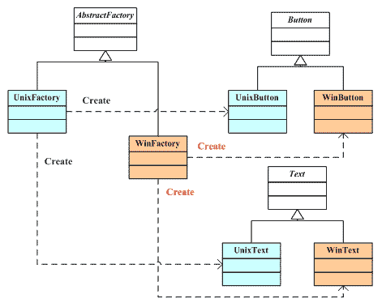

#Abstract Factory 抽象工厂

##解决的问题：

在系统里a,b,c三个组件必须同时使用，但是a的同类 a1和a2这三种方法有共同特点但是是互斥的，b,b1,b2和c,c1,c2和a/a1/a2是一样的。就比如说创建在不同操作系统的视窗环境下都能够运行的系统时，Unix下面有unixButton和 unixText，Win下面也有winButton和winText，unixButton和unixText必须在一个系统unix里面用，而winButton和winText只能在Win下面用。但是winButton和unixButton这两种东西都是有相同的特点的，比如说按下去之后会触发事件，比如说他上面有文字描述等等，但是winButton和unixButton却又是不可以混用的。

那么此问题就可以用抽象工厂很好的解决：

在抽象工厂模式中如何选择使用 winButton ,winText，有具体的工厂类winFactory来负责，因为他们含有选择合适的产品对象的逻辑，所以是与应用系统的商业逻辑紧密相关的。而抽象工厂类来负责定义接口，他才是抽象工厂模式的核心。

而winButton/macButton则是一种产品族，有共同的特点，他们具体特点有抽象产品类或者接口来定义和描述。但是他们具体的实现有具体的产品类负责，这些是客户端最终想要的东西，所以其内部一定充满了应用系统的商业逻辑（触发逻辑/样式逻辑等）。

##类图结构:

##样例实现：

详见代码

##“开放-封闭”原则：

抽象工厂可以很好的应对增加新产品族的问题（即a4/b4/c4），且符合“开放-封闭”原则，但是若是增加新的产品结构的话（即d/d1/d2），就是说a/b/c/d这4中方法必须同时使用了，那就必须修改工厂角色。不符合“开放-封闭”原则。综合来讲，抽象工厂模式以一种倾斜的方式支持增加新的产品，它为新产品族的增加提供方便，而不能为新的产品结构的增加提供这样的方便。

##实现要点：

在抽象工厂模式中，选用哪种产品族的问题，需要采用工厂方法或简单工厂模式来配合解决。
抽象工厂模式和工厂方法模式一样，都把对象的创建延迟到了他的子类中。
具体的工厂类可以设计成单例类，他只向外界提供自己唯一的实例。

##与其他工厂模式的联系和异同：

抽象工厂模式中的具体工厂负责生产一个产品族的产品。而产品族的增加只需要增加与其对应的具体工厂。

3种工厂模式都是创建型模式，都是创建对象的，但都把产品具体创建的过程给隐藏了。

工厂方法模式是针对一种产品结构，而抽象工厂模式是针对多种产品结构。

##适用性：

在以下情况下应当考虑使用抽象工厂模式：

一个系统不应当依赖于产品类实例如何被创建、组合和表达的细节，这对于所有形态的工厂模式都是重要的。

这个系统有多于一个的产品族，而系统只消费其中某一产品族。
同属于同一个产品族的产品是在一起使用的，这一约束必须在系统的设计中体现出来。

系统提供一个产品类的库，所有的产品以同样的接口出现，从而使客户端不依赖于实现。

##应用场景：

支持多种观感标准的用户界面工具箱（Kit）。

游戏开发中的多风格系列场景，比如道路，房屋，管道等。