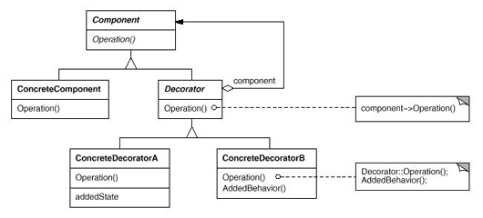

#Decorator 模式

##作用：

动态地给一个对象添加一些额外的职责。就增加功能来说，Decorator 模式相比生成子类更为灵活。

##UML结构图：

##抽象基类：

1. Component：定义一个对象接口，可以为这个接口动态的添加职责。
2. Decorator：维持一个指向Component的指针，并且有一个和Component一致的接口函数。
　　

##接口函数：

Component：：Operation：这个接口函数由Component声明，因此Component的派生类都需要实现，可以在这个接口函数的基础上给它动态添加职责。

##解析：

Decorator的派生类可以为ConcreateComponent类的对象动态的添加职责，或者可以这么说：Decorator的派生类装饰ConcreateComponent类的对象。具体是这么实现的，首先初始化一个ConcreateComponent类的对象(被装饰者)，采用这个对象去生成一个Decorator对象(装饰者)，之后对Operation函数的调用则是对这个Decorator对象成员函数的多态调用。这里的实现要点是Decorator类和ConcreateComponent类都继承自Component，从而两者的接口函数是一致的;其次，Decorator维护了一个指向Component的指针，从而可以实现对Component：：Operation函数的动态调用。