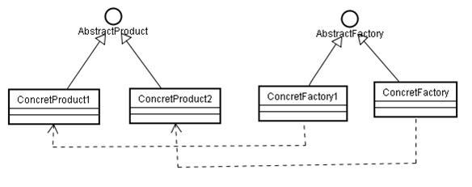
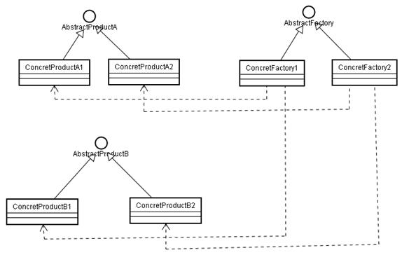

#工厂方法模式

工厂方法模式是对简单工厂模式的改进。首先看看简单工厂模式的缺点。
软件是之所以区别于程序，是因为它可以被人们使用，并能间接创造效益。需求是软件开发的核心，忽视用户的需求，软件本身就没有存在的价值。

假如Nokia又新开发了一款新手机N99，对于采用简单工厂模式设计的系统，我们的做法是：

1. 新增一个CN99类继承自CNokia抽象类，这个符合OCP原则。
注：OCP:Open-Closed Principle开闭原则。OCP关注的是灵活性，改动是通过增加代码进行的，而不是改动现有的代码。对扩展开放，对修改关闭。
2. 修改静态工厂方法中的判断逻辑，增加对N99的创建代码。这个明显违背OCP。

改进简单工厂模式，我们要做的就是克服2中的缺点。

下面的工厂方法模式，新增一个N96的工厂类，不用修改已有的代码，完全支持OCP原则，而且工厂方法模式也完全遵守里氏替换原则，LSP原则是OCP成为可能的重要原则。

>注：Liskov Substitution Principle（里氏代换原则）：子类型(subtype)必须能够替换它们的基类型。

虽然工厂方法模式是对简单工厂模式缺点的该进，这个缺点就是违背软件设计原则OCP。但是并不是工厂方法模式就优于简单工厂模式，只不过后者更符合常规的软件设计理念。 

##UML
###工厂方法:

###抽象工厂:

##4. 应用场景

###工厂方法：

在以下情况下，适用于工厂方法模式：

1. 当一个类不知道它所必须创建的对象的类的时候。
2. 当一个类希望由它的子类来指定它所创建的对象的时候。
3. 当类将创建对象的职责委托给多个帮助子类中的某一个，并且你希望将哪一个帮助子类是代理者这一信息局部化的时候。

###抽象工厂：

1. 一个系统不应当依赖于产品类实例如何被创建、组合和表达的细节，这对于所有形态的工厂模式都是重要的。
2. 这个系统有多于一个的产品族，而系统只消费其中某一产品族。
3. 同属于同一个产品族的产品是在一起使用的，这一约束必须在系统的设计中体现出来。
4. 系统提供一个产品类的库，所有的产品以同样的接口出现，从而使客户端不依赖于实现。